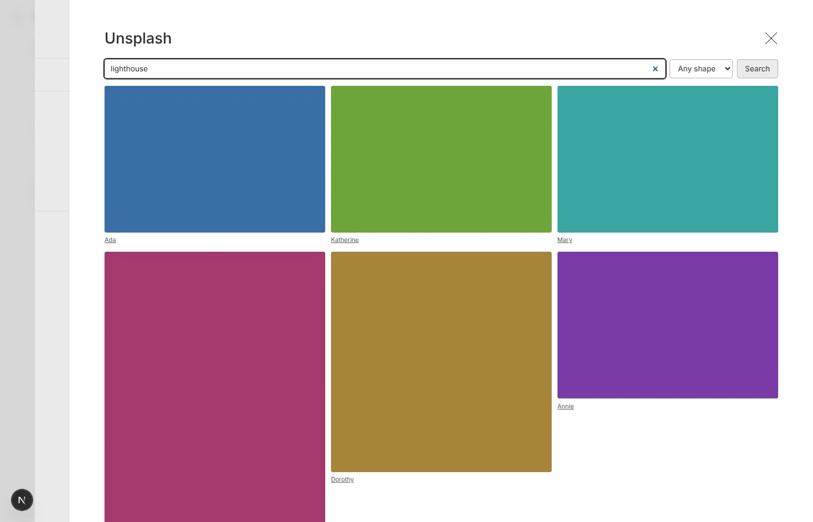

When an article needs a photo and you don't have one, you can now search [Unsplash](https://unsplash.com) from the admin and use what you find, credit and all.

## Where to find it

Wherever you upload to Media there's a **Search Unsplash** button next to **Select a file** and **Paste URL**. That includes the **Create New** drawer you get from an article's image fields, so you don't have to leave the article you're writing.

## Picking a photo

1. Click **Search Unsplash** and type what you're looking for.
2. Narrow it to landscape, portrait or square photos if the slot needs a particular shape.
3. Click a photo. It becomes the upload, just as if you'd picked a file from your computer.

The photographer's credit goes into the caption straight away, linked to their Unsplash profile as Unsplash asks. Fill in the alt text as you would for any image, then save.

## Good to know

- **Leave the credit in.** The first save writes it again from Unsplash, so editing it before then changes nothing. Swapping the file for one of your own takes it out.
- **Searches are rationed.** Unsplash allows us a limited number of requests an hour, and each search, pick and save uses one or two. The search drawer shows how many are left; if they run out, try again later.
- **Saving needs Unsplash.** If Unsplash can't be reached when you save, the save fails rather than keeping a photo without its credit. Wait a moment and save again.
